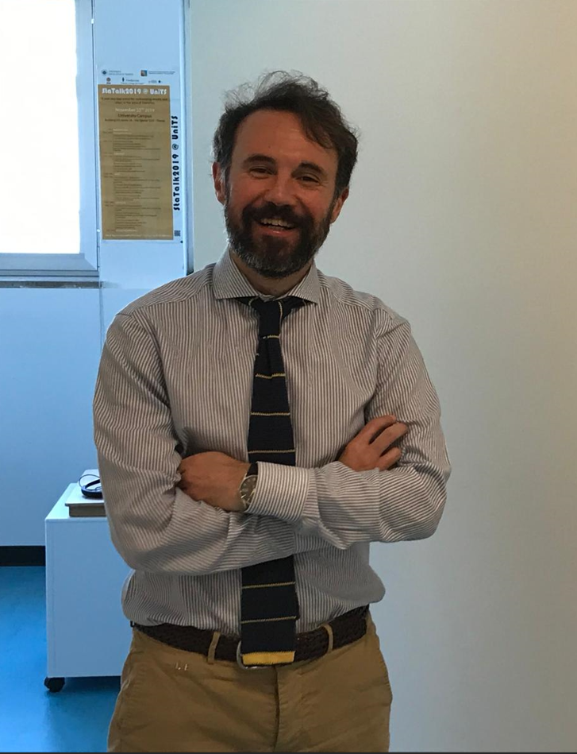

# Leonardo Egidi

  

    

      I am an <strong>assistant professor (rtd-b)</strong> of <strong>Statistics</strong> at the Department of Business, Economics, Mathematics and Statistics 'Bruno de Finetti' (DEAMS) of the University of Trieste.  

      I got my PhD in Statistics among the Department of Statistical Sciences, University of Padova. In the period January-July 2016, I was a visiting scholar among the Department of Statistical Sciences of the Columbia University, New York.  

      My research focus embraces <strong>theoretical and applied statistics</strong>, with notable work in Bayesian methods, computational statistics, and their applications in fields such as biostatistics, economics, genomics, and sports analytics.  

      I supervise master’s and PhD students and collaborate internationally with universities like Columbia University and the University of Zurich. I am also involved in various statistical consulting projects, particularly in the health and business sectors.  

      I teach the courses 'Advanced Statistics', 'Statistical and Machine Learning', and 'Bayesian Statistics'.  

      I am an active member of the Italian Statistical Society (SIS) and the International Society for Bayesian Analysis. I am the deputy chair of the ISI Special Interest Group in Sports Statistics.
    

  

  

    
  

