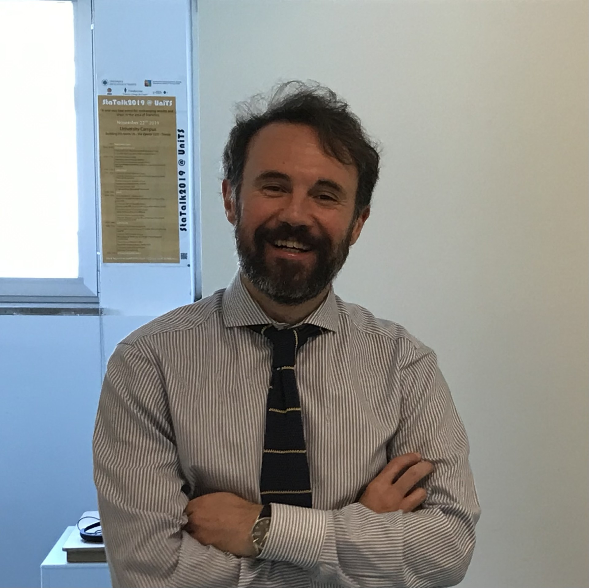
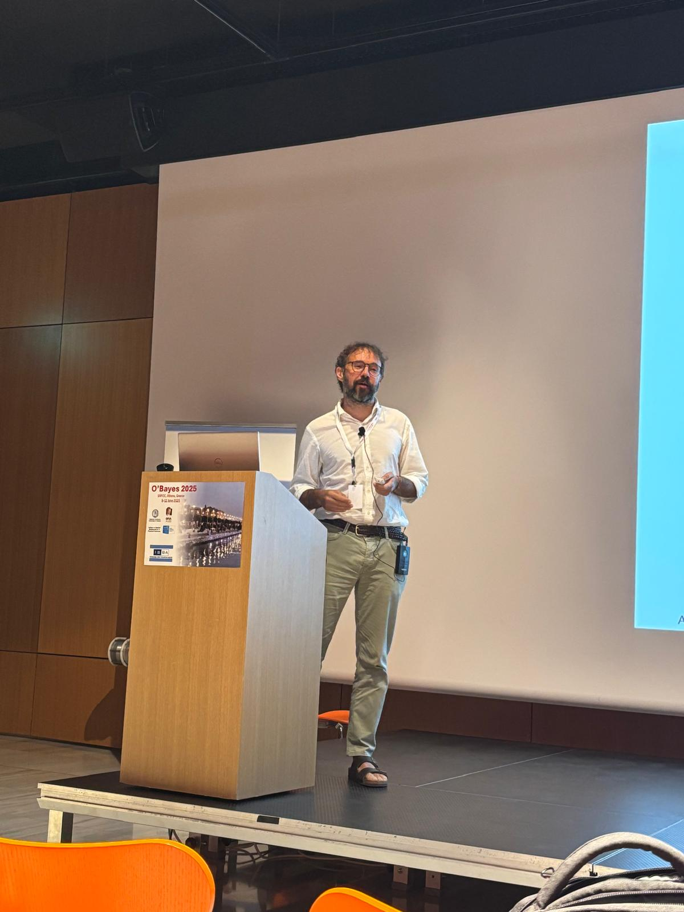
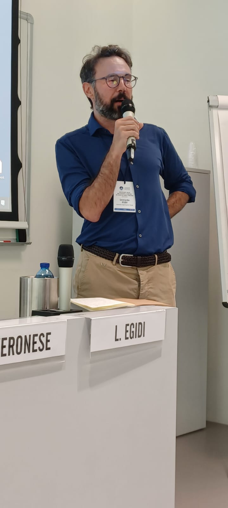

# Leonardo Egidi

    <a href="mailto:legidi@units.it" class="icon-link" target="_blank">
        <i class="fas fa-envelope"></i> <!-- Icona dell'email -->
        Mail
    </a>
    <a href="https://deams.units.it/en/node/45071" class="icon-link" target="_blank">
    	<i class="fas fa-university"></i>
    	University
    </a>
    <a href="https://www.linkedin.com/in/leonardo-egidi-ba466261/?originalSubdomain=it" class="icon-link" target="_blank">
        <i class="fab fa-linkedin"></i>
        LinkedIn
    </a>
    <a href="https://scholar.google.com/citations?user=Ux1LY_Qx7T8C&hl=it&oi=ao" class="icon-link" target="_blank">
       <i class="fas fa-book"></i>  
      Google Scholar
    </a>
    <a href="https://orcid.org/0000-0003-3211-905X" class="icon-link" target="_blank">
        <i class="fa-brands fa-orcid"></i>
        ORCID
    </a>
    <a href="https://www.researchgate.net/profile/Leonardo-Egidi" class="icon-link" target="_blank">
        <i class="fa-brands fa-researchgate"></i>
        ResGate
    </a>
    <a href="https://www.youtube.com/results?search_query=leonardo+egidi" class="icon-link" target="_blank">
        <i class="fa-brands fa-youtube"></i>
        YouTube
    </a>
   <a href="https://github.com/LeoEgidi" class="icon-link" target="_blank">
        <i class="fa-brands fa-github"></i>
         Github
    </a>
   <a href="https://www.scopus.com/authid/detail.uri?authorId=57195512567" class="icon-link" target="_blank">
        <i class="fas fa-microscope"></i> 
        Scopus
   </a>

## Bio breve

[🔙 Torna alla versione in inglese](/)

  

     

      Sono un <strong> ricercatore e professore </strong> di <strong>Statistica</strong> presso il 
      <a href="https://deams.units.it/" target="_blank">Dipartimento di Scienze Economiche, Aziendali, Matematiche e Statistiche 'Bruno de Finetti' (DEAMS)</a> 
      dell' <a href="https://portale.units.it/it" target="_blank">Università degli studi di Trieste</a>.
    

    

      Sono stato un ricercatore post-doc presso il  
      <a href="https://deams.units.it/" target="_blank">DEAMS</a> (2018-2020). 
      Ho ottenuto un dottorato in statistica presso il  
      <a href="https://www.stat.unipd.it/" target="_blank">Dipartimento di Scienze Statistiche</a> dell'  
      <a href="https://www.unipd.it/" target="_blank">Università degli studi di Padova</a> nel 2018. 
      Nel 2016 sono stato visiting scholar presso il 
      <a href="https://stat.columbia.edu/" target="_blank">Department of Statistical Sciences</a> della 
      <a href="https://www.columbia.edu/" target="_blank">Columbia University</a> a New York sotto la supervisione di 
      <a href="http://www.stat.columbia.edu/~gelman/" target="_blank">Andrew Gelman</a>.
    

  

    
  

  
## Ricerca

La mia ricerca si occupa di <strong>statistica teorica e applicata</strong>, con una forte caratterizzazione per i <strong>metodi bayesiani</strong>, la statistica computazionale e applicazioni in campi quali la biostatistica, l'economia, la genomica e lo sport. Per saperne di più sui miei [argomenti di ricerca](https://leoegidi.github.io/leonardo-egidi-research/){:target="_blank" rel="noopener noreferrer"} consulta la pagina dedicata  e visita [la mia lista di pubblicazioni scientifiche](https://leoegidi.github.io/leonardo-egidi-publications/){:target="_blank" rel="noopener noreferrer"}.  

Sono il coordinatore a livello nazionale, o anche **Principal Investigator** (PI), del progetto [PRIN 2022](https://prin.mur.gov.it/Iniziative/Detail?key=FiJNdaCuA71Xq3jYMAuZeQ%3D%3D){:target="_blank" rel="noopener noreferrer"}  dal titolo: *SMARTsports - Statistical Models and AlgoRiThms in sports. Applications in professional and amateur contexts, with able-bodied and disabled athletes* finanziato dal [Ministero dell' Università e della Ricerca](https://www.mur.gov.it/it){:target="_blank" rel="noopener noreferrer"} (CUP: J53D23003860006) nel 2023. Si tratta di un progetto congiunto con l' [Università degli studi di Udine](https://www.uniud.it/it/ricerca/progetti-e-iniziative/progetti-finanziati/prin-2022/dies/smartsports-statistical-models-and-algorithms-in-sports-applications-in-professional-and-amateur-contexts-with-able-bodied-and-disabled-athletes){:target="_blank" rel="noopener noreferrer"} 
e l' [Università degli studi di Brescia](https://www.unibs.it/it){:target="_blank" rel="noopener noreferrer"}.

## Divulgazione scientifica

Svolgo spesso attività divulgativa, come [talks](https://www.youtube.com/results?search_query=leonardo+egidi){:target="_blank" rel="noopener noreferrer"}, seminari, e [interviste](https://www.youtube.com/results?search_query=leonardo+egidi){:target="_blank" rel="noopener noreferrer"} sulla mia attività scientifica e su temi relativi alla ricerca scientifica.

## Attività didattica, di supervisione e di consulenza     

Faccio parte del collegio docenti del PhD in [Applied Data Science and Artificial Intelligence (ADSAI)](https://adsai.units.it/){:target="_blank" rel="noopener noreferrer"} dell' [Università degli studi di Trieste](https://portale.units.it/it){:target="_blank" rel="noopener noreferrer"}.

Supervisiono studenti di laurea magistrale e di dottorato, visita [la mia lista completa di studenti supervisionati](https://leoegidi.github.io/leonardo-egidi-students/){:target="_blank" rel="noopener noreferrer"}.

Ho collaborazioni internazionali con la [Columbia University](https://www.columbia.edu/){:target="_blank" rel="noopener noreferrer"}, l' [Athens University of Economics and Business](https://www.aueb.gr/){:target="_blank" rel="noopener noreferrer"},
e la [University of Zurich](https://www.uzh.ch/en.html){:target="_blank" rel="noopener noreferrer"}. Sono coinvolto in molti progetti di statistica applicata, particolarmente nell'ambito della salute e dell'economia.

Insegno 'Advanced Statistics', 'Statistical and Machine Learning', e 'Bayesian Statistics'. Qui la lista completa dei [miei insegnamenti](https://leoegidi.github.io/leonardo-egidi-teaching/){:target="_blank" rel="noopener noreferrer"}.

Sono un membro attivo della [Società Italiana di Statistica (SIS)](https://www.sis-statistica.it/){:target="_blank" rel="noopener noreferrer"} e dell' [International Society for Bayesian Analysis (ISBA)](https://bayesian.org/){:target="_blank" rel="noopener noreferrer"}. 
Sono vice-chair dell' [ISI Special Interest Group in Sports Statistics](https://www.isi-web.org/committee/special-interest-group-sports-statistics){:target="_blank" rel="noopener noreferrer"}.

Visita la mia [pagina accademica ufficiale](https://deams.units.it/en/node/45071){:target="_blank" rel="noopener noreferrer"}.

Puoi scaricare una copia aggiornata del mio CV integrale qui:
<a href="{{ '/paper/cv.pdf' | relative_url }}" target="_blank">
    <i class="fas fa-file-pdf"></i> Download PDF
</a>

  

    
  

