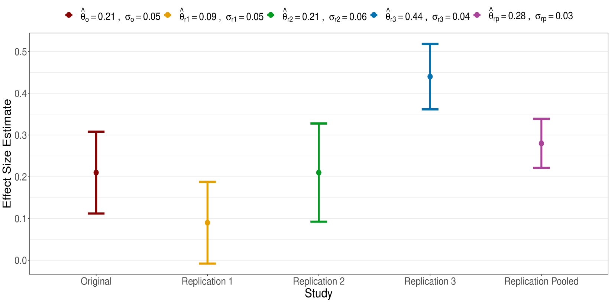

  

     

     <strong>Bayesian inference</strong> 
    

  

    
  

  

     

     <strong>Robust clustering</strong> 
    

  

    
  

  

     

     <strong>Replication crisis in science</strong> 
    

  

    
  

  

     

     <strong>Sports statistics</strong> 
    

  

    
  

  

     

     <strong>Population genomics modeling</strong> 
    

  

    
  

  

     

     <strong>Biostatistics and medical studies</strong> 
    

  

    
  

